# Greenhouse Backend


# Introduction

Welcome to the README for the SEP4 Greenhouse Environment Monitoring System! This project focuses on developing a cloud hosted IoT-system that can retrieve and visualize sensor data.
This project is a collaborative effort by three teams: frontend, backend, and iot. Each team plays a crucial role in the development and operation of the system, working together to create a seamless user experience and efficient control mechanisms.

This repository contains project backend, which is responsible for:
- Retrieving data from IoT >> processing and storing in database >> sending to Frontend
- Retieving data (settings to apply in device) from Frontend >> processing and storing in database >> sending to IoT

### Repository Links

To access the repositories for the different components of the SEP4 Greenhouse Environment Monitoring System, please use the following links:

- [frontend](https://github.com/ham222/greenhouse-frontend)<br/>
- [backend](https://github.com/xoxkoo/greenhouse-backend)
- [iot](https://github.com/wikcioo/greenhouse-iot)

### System Overview

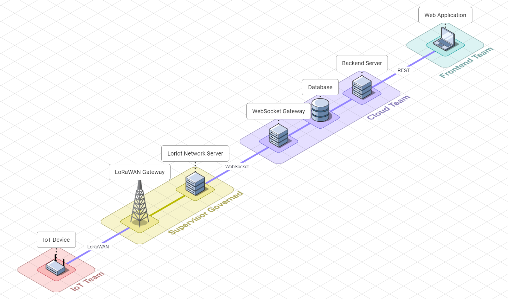

# Development environment

Following section describes how to set up your own version of development environment for the project.

## JetBrains Rider

Solution has been designed with preference for JetBrains Rider as the environment for editing, building, testing, analysing, refactoring, managing database & version control system. It is also available for all platforms.

This results in particular set of functionalities that include (but are not limited to):

- **NuGet packages:**\
  Set of NuGet packages that are needed to run the project, if not installed.\
  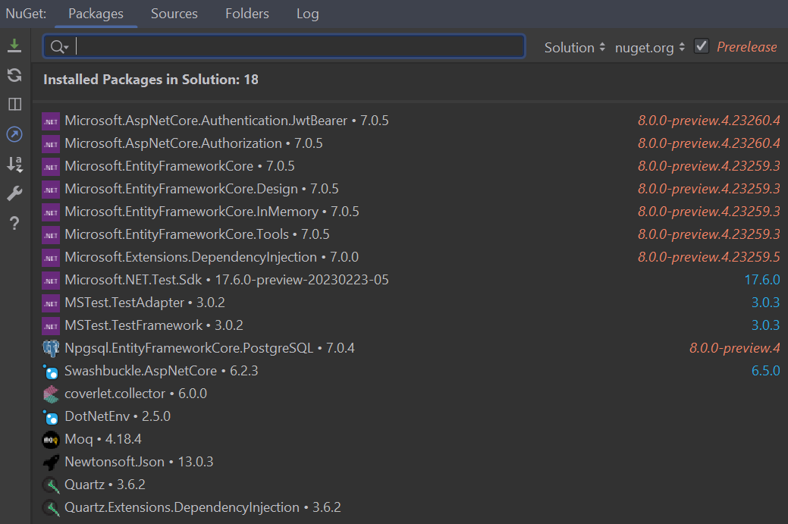

# Setup project

1. Install Git [here](https://git-scm.com/downloads)
2. Install .NET SDK [here](https://dotnet.microsoft.com/download)
3. Clone the repository: Open terminal and navigate to a directory, where you want to clone the repository. Then paste the following command in terminal:
```bash 
git clone https://github.com/xoxkoo/greenhouse-backend.git
```
4. Build the project: Change directory into the cloned repository, using following command:
```bash 
cd greenhouse-backend
```
Then run this command:
```bash 
dotnet build
```
5. In the project directory create a file named ".nev" and paste there following code:
```bash 
Up to discoussion
```

# Run application locally

1. Start the application: once the project is built and configured, you can run the application using rider:
   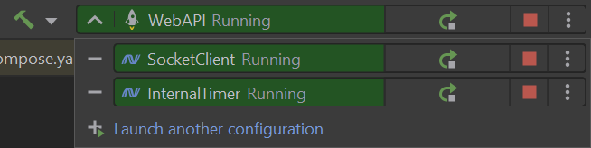
2. Check terminal, if SocketClient displays the following messages:
   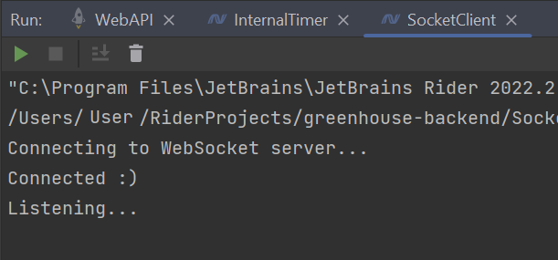
3. Check terminal, if WebAPI displays the following messages:
   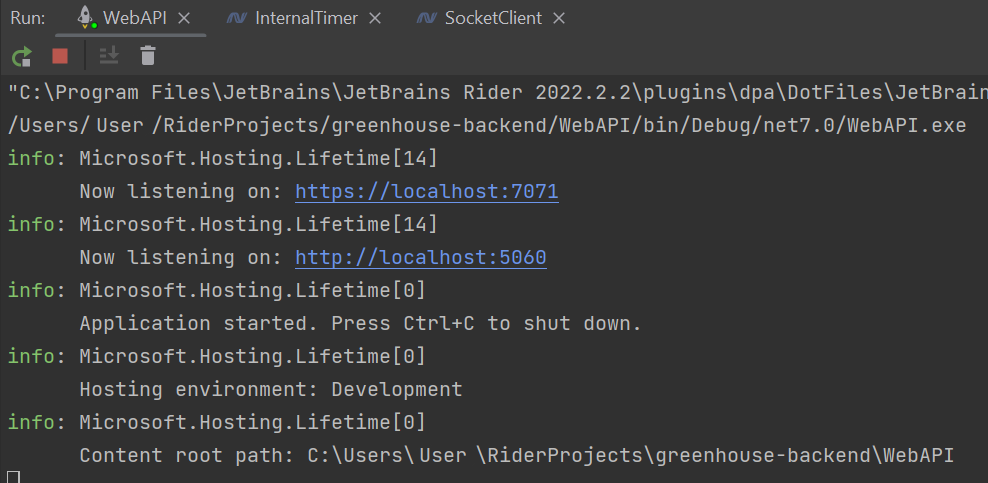
4. Application can be tested using Swagger. Take first address from step 3 and add "/swagger" at the end. For example:
```bash 
https://localhost:7071/swagger
```
5. Database can be accessed inside Rider. Click "Database" button in most left column of the application. Tables can be found in root as image shows:
   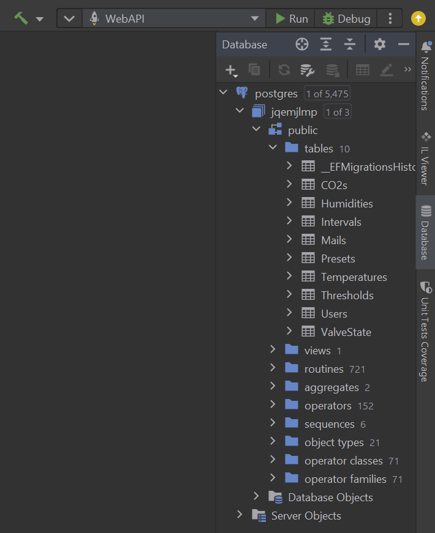

# Run application on Docker

1. Install Docker [here](https://www.docker.com/get-started)
2. Open terminal and navigate to project directory.
3. Build the Docker image using the Dockerfile provided in the repository:
```bash 
docker-compose build
```
This command builds the Docker image and tags it with the name greenhouse-backend.
4. Run the Docker container: After the Docker image is built, you can run the application in a Docker containers using the following command:
```bash 
docker-compose up
```
This command starts a Docker containers from the greenhouse-backend images.
5. Access the application: Once the Docker container is running, you can access the application by opening a web browser and navigating to http://localhost:8080 (or the corresponding host and port). You should see the application running.

# Test coverage

Test coverage for ```main``` is always available at [projects' GitHub Pages page](https://xoxkoo.github.io/greenhouse-backend/).

# Snippets of project documentation

## Use case Diagram
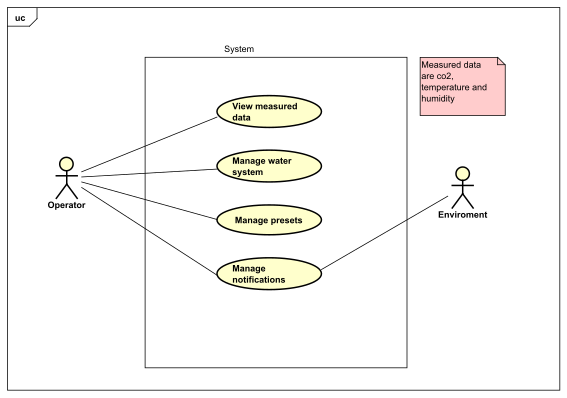
## Domain model
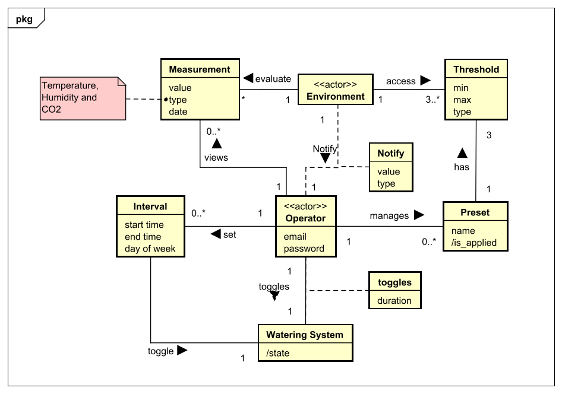
## Backend architecture
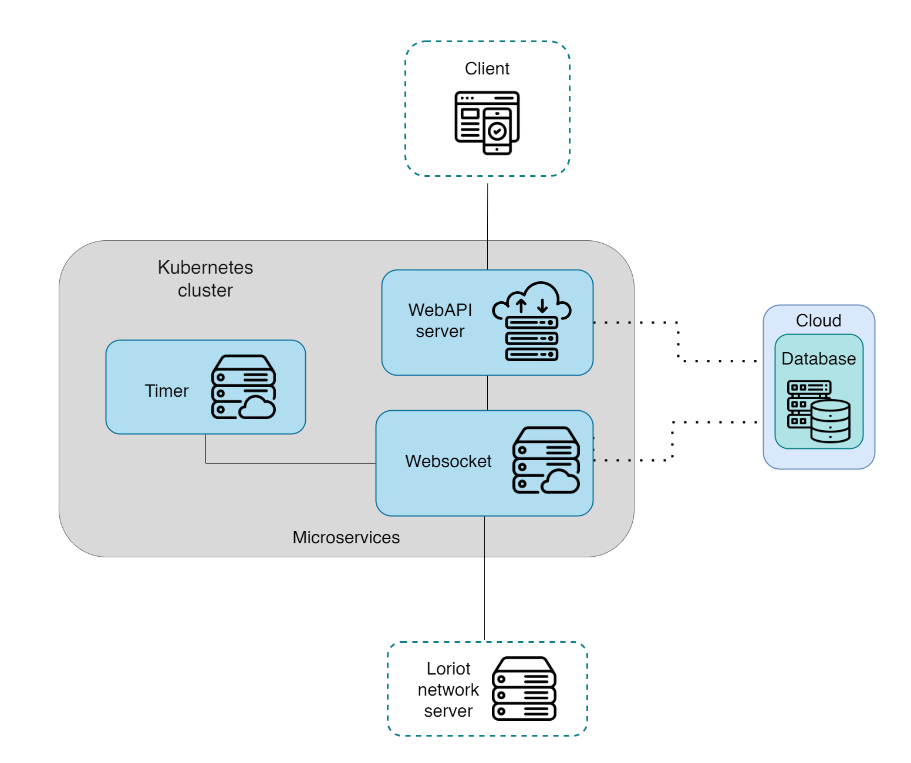
## Package diagram
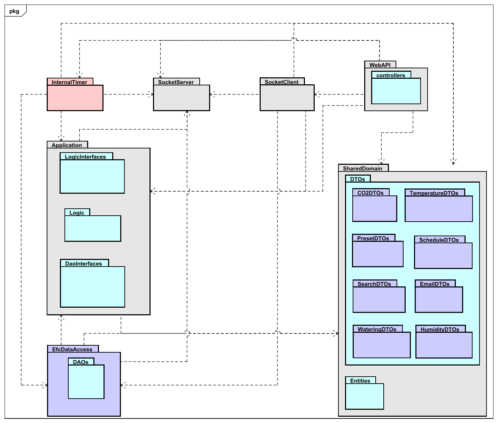
## Class diagram

## Sequence diagrams
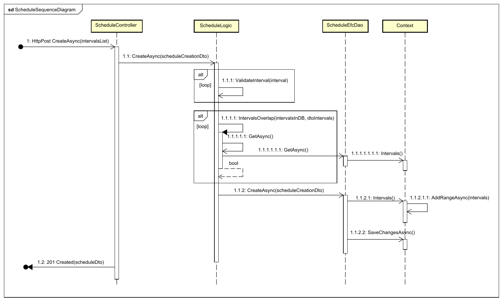
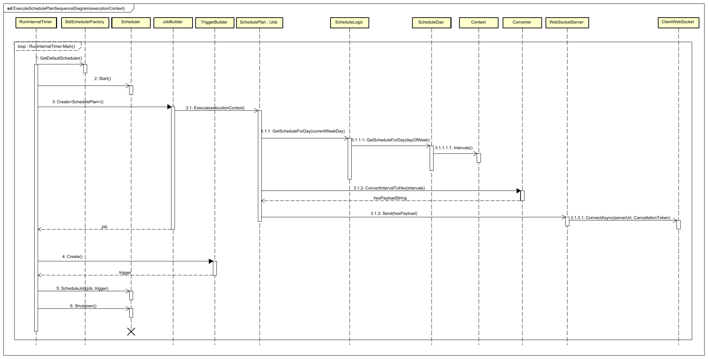
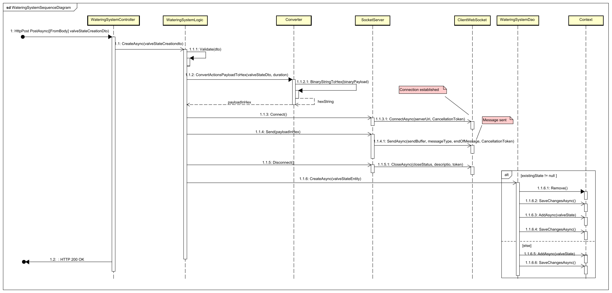